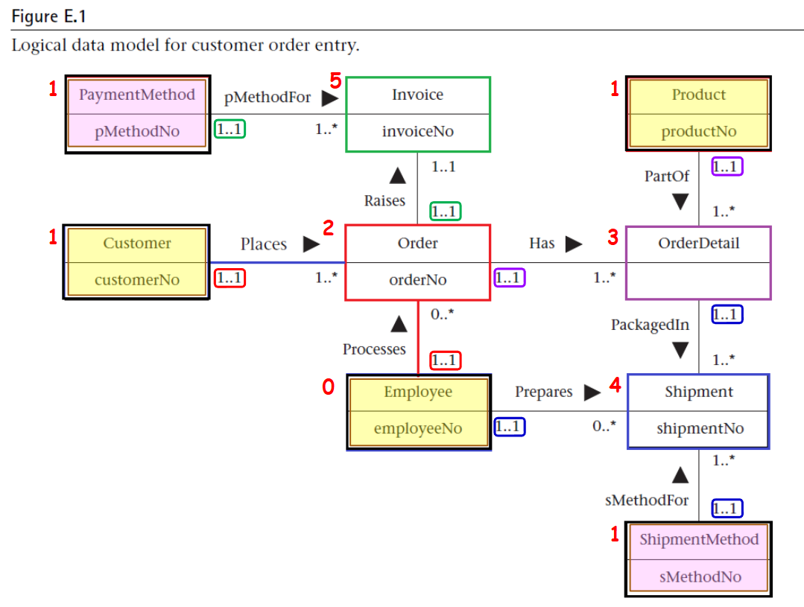

# 虛擬貨幣投資幣種管理系統

本系統旨在幫助使用者管理加密貨幣投資組合，提供交易紀錄、資產統計分析，並支援持有幣種的管理功能。

---

## 成員自我介紹

您好！我們是虎尾科技大學四資工三乙的學生，以下是我們專題的成員自我介紹：

* **組長**：王忠仁（boxcat-none）
  **學號**：41143209
  **興趣**：觀看 YouTube 的旅遊、美食影片，並從中學習各種知識。

* **組員**：張家誠（Adsgfjhk）
  **學號**：41143231
  **興趣**：閱讀科技與程式設計文章、手遊與打球放鬆。

* **組員**：劉向宏（liuleo0518）
  **學號**：41143248
  **興趣**：打網球（體育績優升學）、現專注於資訊工程。

---

## 功能特色

* **使用者管理**：帳號註冊、登入、權限設定
* **資產管理**：查看持有幣種、實時價格、盈虧計算
* **交易紀錄**：記錄買入、賣出、交易時間與價格

---

## 系統需求

### 功能性需求

#### 使用者管理：

* 使用者可以註冊帳號，提供使用者名稱、電子郵件和密碼。
* 使用者可以通過電子郵件和密碼登入系統。
* 系統應支援權限設定，區分一般使用者與管理員角色。
* 使用者可以更新個人資料（例如電子郵件或密碼）。

#### 資產管理：

* 使用者可以查看當前持有的所有幣種及其數量。
* 系統應計算每種幣種的盈虧（基於買入價格與當前價格）。
* 使用者可以新增或移除持有的幣種。

#### 交易紀錄：

* 使用者可以記錄買入和賣出的交易，包括幣種、數量、價格和交易時間。
* 系統應提供交易歷史查詢功能，按時間或幣種過濾。
* 交易紀錄應自動更新持有幣種的數量（例如賣出後減少持有量）。

### 非功能性需求

#### 效能：

* 系統應快速完成一般查詢。
* 系統應支持多名使用者同時操作，且無顯著延遲。

#### 安全性：

* 使用者密碼必須加密儲存。
* 系統應防止常見的安全漏洞。

#### 可用性：

* 系統介面應直觀，支援桌上型和行動裝置瀏覽。
* 提供錯誤訊息提示。

#### 可維護性：

* 資料庫結構應設計為易於擴展。
* 程式碼應遵循模組化設計，方便後續維護和更新。

#### 可靠性：

* 系統應保證資料一致性。

---

## 資料庫結構

### 1. 使用者表（users）

| 欄位名稱           | 類型      | 描述         |
| -------------- | ------- | ---------- |
| id             | INT     | 使用者 ID（主鍵） |
| username       | VARCHAR | 使用者名稱      |
| password\_hash | VARCHAR | 密碼（加密）     |
| email          | VARCHAR | 電子郵件       |

### 2. 幣種表（cryptos）

| 欄位名稱           | 類型      | 描述            |
| -------------- | ------- | ------------- |
| id             | INT     | 幣種 ID（主鍵）     |
| symbol         | VARCHAR | 幣種代號（BTC、ETH） |
| name           | VARCHAR | 幣種名稱          |
| current\_price | DECIMAL | 當前價格          |

### 3. 持倉表（holdings）

| 欄位名稱       | 類型      | 描述         |
| ---------- | ------- | ---------- |
| id         | INT     | 持倉 ID（主鍵）  |
| user\_id   | INT     | 使用者 ID（外鍵） |
| crypto\_id | INT     | 幣種 ID（外鍵）  |
| amount     | DECIMAL | 持有數量       |
| buy\_price | DECIMAL | 買入價格       |

### 4. 交易紀錄表（transactions）

| 欄位名稱              | 類型        | 描述         |
| ----------------- | --------- | ---------- |
| id                | INT       | 交易 ID（主鍵）  |
| user\_id          | INT       | 使用者 ID（外鍵） |
| crypto\_id        | INT       | 幣種 ID（外鍵）  |
| transaction\_type | VARCHAR   | 交易類型（買/賣）  |
| amount            | DECIMAL   | 交易數量       |
| price             | DECIMAL   | 交易價格       |
| timestamp         | TIMESTAMP | 交易時間       |

---

## ER Diagram


## 資料庫Schema(SQL)

### 1. 創建資料表

```sql
-- 使用者表
CREATE TABLE users (
    id INT PRIMARY KEY,
    username VARCHAR(50) NOT NULL,
    password_hash VARCHAR(255) NOT NULL,
    email VARCHAR(100) NOT NULL UNIQUE
);

-- 幣種表
CREATE TABLE cryptos (
    id INT PRIMARY KEY,
    symbol VARCHAR(10) NOT NULL UNIQUE,
    name VARCHAR(50) NOT NULL,
    current_price DECIMAL(15, 2) NOT NULL
);

-- 持倉表
CREATE TABLE holdings (
    id INT PRIMARY KEY,
    user_id INT NOT NULL,
    crypto_id INT NOT NULL,
    amount DECIMAL(15, 8) NOT NULL,
    buy_price DECIMAL(15, 2) NOT NULL,
    FOREIGN KEY (user_id) REFERENCES users(id),
    FOREIGN KEY (crypto_id) REFERENCES cryptos(id)
);

-- 交易紀錄表
CREATE TABLE transactions (
    id INT PRIMARY KEY,
    user_id INT NOT NULL,
    crypto_id INT NOT NULL,
    transaction_type VARCHAR(10) NOT NULL CHECK (transaction_type IN ('buy', 'sell')),
    amount DECIMAL(15, 8) NOT NULL,
    price DECIMAL(15, 2) NOT NULL,
    timestamp TIMESTAMP DEFAULT CURRENT_TIMESTAMP,
    FOREIGN KEY (user_id) REFERENCES users(id),
    FOREIGN KEY (crypto_id) REFERENCES cryptos(id)
);
```
---

## 舉例說明

### 1. 使用者表（users）

```
id | username    | password_hash       | email
---+-------------+---------------------+----------------------
1  | john_doe    | hashed_password_123 | john@example.com
2  | jane_smith  | hashed_password_456 | jane@example.com
```

### 2. 幣種表（cryptos）

```
id | symbol | name     | current_price
---+--------+----------+---------------
1  | BTC    | Bitcoin  | 60000.50
2  | ETH    | Ethereum | 3000.25
```

### 3. 持倉表（holdings）

```
id | user_id | crypto_id | amount | buy_price
---+---------+-----------+--------+-----------
1  | 1       | 1         | 0.5    | 58000.00
2  | 2       | 2         | 10.0   | 2900.00
```

### 4. 交易紀錄表（transactions）

```
username   | symbol | transaction_type | amount | price   | timestamp
-----------+--------+------------------+--------+---------+-------------------------
john_doe   | BTC    | buy              | 0.5    | 58000.00| 2025-05-01 10:00:00
jane_smith | ETH    | buy              | 10.0   | 2900.00 | 2025-05-02 12:00:00
```

---

## 設計說明

* **主鍵與外鍵**：每個表的主鍵為 `id`，`holdings` 與 `transactions` 表中的 `user_id` 與 `crypto_id` 分別為外鍵，參照 `users` 和 `cryptos` 表。
* **資料類型**：

  * `DECIMAL(15, 2)` 用於價格，保留兩位小數。
  * `DECIMAL(15, 8)` 用於加密貨幣數量，小數點後八位。
  * `TIMESTAMP` 使用 `DEFAULT CURRENT_TIMESTAMP`。
* **約束條件**：

  * `users.email` 與 `cryptos.symbol` 為唯一值。
  * `transaction_type` 限制只能為 `'buy'` 或 `'sell'`。

---

## 作業一



### Customer Table
**Schema**: customerNo, customerName, customerStreet, customerCity, customerState, customerZipCode, custTelNo, custFaxNo, DOB, maritalStatus, creditRating  
**Primary Key**: customerNo  
**Alternate Keys**: custTelNo, custFaxNo

| customerNo | customerName | customerStreet       | customerCity | customerState | customerZipCode | custTelNo   | custFaxNo   | DOB        | maritalStatus | creditRating |
|------------|--------------|----------------------|--------------|---------------|-----------------|-------------|-------------|------------|---------------|--------------|
| C001       | 陳阿勇       | 忠孝東路一段         | 台北市       | 中正區        | 100             | 0912345678  | 0212345678  | 1985-03-15 | Married       | A            |
| C002       | 田小柔       | 三芝四路88號         | 基隆市       | 參考區        | 802             | 0923456789  | 0223456789  | 1990-07-22 | Single        | B            |
| C003       | 陳大飛       | 公益路456號3樓       | 台北市       | 西區          | 403             | 0934567890  | 0234567890  | 1978-11-30 | Divorced      | A            |

### Employee Table
**Schema**: employeeNo, title, firstName, middleName, lastName, address, workTelExt, homeTelNo, empEmailAddress, socialSecurityNumber, DOB, position, sex, salary, dateStarted  
**Primary Key**: employeeNo  
**Alternate Key**: socialSecurityNumber

| employeeNo | title | firstName | middleName | lastName | address            | workTelExt | homeTelNo  | empEmailAddress       | socialSecurityNumber | DOB        | position       | sex  | salary  | dateStarted |
|------------|-------|-----------|------------|----------|--------------------|------------|------------|-----------------------|----------------------|------------|----------------|------|---------|-------------|
| E001       | Mr.   | Wei       | Chen       | Lin      | 台北市中山路100號  | 1234       | 0912345678 | wei.lin@company.com   | 123-45-6789          | 1980-05-10 | Manager        | M    | 60000   | 2015-01-15  |
| E002       | Ms.   | Mei       | Ling       | Wang     | 基隆市和平路50號   | 5678       | 0923456789 | mei.wang@company.com  | 234-56-7890          | 1992-09-25 | Sales Rep      | F    | 45000   | 2018-03-22  |
| E003       | Mr.   | Hao       | Yu         | Zhang    | 台中市自由路80號   | 9012       | 0934567890 | hao.zhang@company.com | 345-67-8901          | 1988-12-01 | Shipper        | M    | 40000   | 2020-06-10  |

### Invoice Table
**Schema**: invoiceNo, dateRaised, datePaid, creditCardNo, holdersName, expiryDate, orderNo, pMethodNo  
**Primary Key**: invoiceNo  
**Foreign Keys**: orderNo (Order), pMethodNo (PaymentMethod)

| invoiceNo | dateRaised  | datePaid   | creditCardNo     | holdersName | expiryDate | orderNo | pMethodNo |
|-----------|-------------|------------|------------------|-------------|------------|---------|-----------|
| INV001    | 2025-01-10  | 2025-01-15 | 1234567812345678 | 陳阿勇      | 2028-12-31 | ORD001  | PM001     |
| INV002    | 2025-02-05  | 2025-02-10 | 2345678923456789 | 田小柔      | 2029-06-30 | ORD002  | PM002     |
| INV003    | 2025-03-01  | NULL       | 3456789034567890 | 陳大飛      | 2030-03-31 | ORD003  | PM003     |

### Order Table
**Schema**: orderNo, orderDate, billingStreet, billingCity, billingState, billingZipCode, promisedDate, status, customerNo, employeeNo  
**Primary Key**: orderNo  
**Foreign Keys**: customerNo (Customer), employeeNo (Employee)

| orderNo | orderDate  | billingStreet     | billingCity | billingState | billingZipCode | promisedDate | status    | customerNo | employeeNo |
|---------|------------|-------------------|-------------|--------------|----------------|--------------|-----------|------------|------------|
| ORD001  | 2025-01-09 | 忠孝東路一段      | 台北市      | 中正區       | 100            | 2025-01-20   | Shipped   | C001       | E001       |
| ORD002  | 2025-02-04 | 三芝四路88號      | 基隆市      | 參考區       | 802            | 2025-02-15   | Processing| C002       | E002       |
| ORD003  | 2025-02-28 | 公益路456號3樓    | 台北市      | 西區         | 403            | 2025-03-10   | Pending   | C003       | E003       |

### OrderDetail Table
**Schema**: orderNo, productNo, quantityOrdered  
**Primary Key**: orderNo, productNo  
**Foreign Keys**: orderNo (Order), productNo (Product)

| orderNo | productNo | quantityOrdered |
|---------|-----------|-----------------|
| ORD001  | P001      | 5               |
| ORD002  | P002      | 3               |
| ORD003  | P003      | 10              |

### PaymentMethod Table
**Schema**: pMethodNo, paymentMethod  
**Primary Key**: pMethodNo

| pMethodNo | paymentMethod |
|-----------|---------------|
| PM001     | Credit Card   |
| PM002     | Cash          |
| PM003     | Check         |

### Product Table
**Schema**: productNo, productName, serialNo, unitPrice, quantityOnHand, reorderLevel, reorderQuantity, reorderLeadTime  
**Primary Key**: productNo  
**Alternate Key**: serialNo

| productNo | productName    | serialNo    | unitPrice | quantityOnHand | reorderLevel | reorderQuantity | reorderLeadTime |
|-----------|----------------|-------------|-----------|----------------|--------------|-----------------|-----------------|
| P001      | Laptop         | SN123456    | 1000      | 50             | 10           | 20              | 7 days          |
| P002      | Smartphone     | SN789012    | 500       | 100            | 20           | 30              | 5 days          |
| P003      | Headphones     | SN345678    | 50        | 200            | 50           | 100             | 3 days          |

### Shipment Table
**Schema**: shipmentNo, quantity, shipmentDate, completeStatus, orderNo, productNo, employeeNo, sMethodNo  
**Primary Key**: shipmentNo  
**Foreign Keys**: orderNo, productNo (OrderDetail), employeeNo (Employee), sMethodNo (ShipmentMethod)

| shipmentNo | quantity | shipmentDate | completeStatus | orderNo | productNo | employeeNo | sMethodNo |
|------------|----------|--------------|----------------|---------|-----------|------------|-----------|
| SHP001     | 5        | 2025-01-12   | Complete       | ORD001  | P001      | E003       | SM001     |
| SHP002     | 2        | 2025-02-06   | Partial        | ORD002  | P002      | E003       | SM002     |
| SHP003     | 8        | 2025-03-02   | Pending        | ORD003  | P003      | E003       | SM003     |

### ShipmentMethod Table
**Schema**: sMethodNo, shipmentMethod  
**Primary Key**: sMethodNo

| sMethodNo | shipmentMethod |
|-----------|----------------|
| SM001     | Express        |
| SM002     | Standard       |
| SM003     | Overnight      |