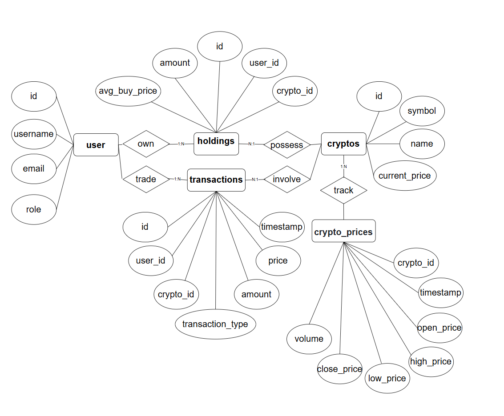

# 虛擬貨幣投資幣種管理系統

本系統旨在幫助使用者管理加密貨幣投資組合，提供交易紀錄、資產統計分析，並支援持有幣種的管理功能。

---

## 成員自我介紹

您好！我們是虎尾科技大學四資工三乙的學生，以下是我們專題的成員自我介紹：

* **組長**：王忠仁（boxcat-none）
  **學號**：41143209
  **興趣**：觀看 YouTube 的旅遊、美食影片，並從中學習各種知識。

* **組員**：張家誠（Adsgfjhk）
  **學號**：41143231
  **興趣**：閱讀科技與程式設計文章、手遊與打球放鬆。

* **組員**：劉向宏（liuleo0518）
  **學號**：41143248
  **興趣**：打網球（體育績優升學）、現專注於資訊工程。

---

## 功能特色

* **使用者管理**：帳號註冊、登入、權限設定
* **資產管理**：查看持有幣種、實時價格、盈虧計算
* **交易紀錄**：記錄買入、賣出、交易時間與價格

---

## 系統需求

### 功能性需求

#### 使用者管理：

* 使用者可以註冊帳號，提供使用者名稱、電子郵件和密碼。
* 使用者可以通過電子郵件和密碼登入系統。
* 系統應支援權限設定，區分一般使用者與管理員角色。
* 使用者可以更新個人資料（例如電子郵件或密碼）。

#### 資產管理：

* 使用者可以查看當前持有的所有幣種及其數量。
* 系統應計算每種幣種的盈虧（基於買入價格與當前價格）。
* 使用者可以新增或移除持有的幣種。

#### 交易紀錄：

* 使用者可以記錄買入和賣出的交易，包括幣種、數量、價格和交易時間。
* 系統應提供交易歷史查詢功能，按時間或幣種過濾。
* 交易紀錄應自動更新持有幣種的數量（例如賣出後減少持有量）。

### 非功能性需求

#### 效能：

* 系統應快速完成一般查詢。
* 系統應支持多名使用者同時操作，且無顯著延遲。

#### 安全性：

* 使用者密碼必須加密儲存。
* 系統應防止常見的安全漏洞。

#### 可用性：

* 系統介面應直觀，支援桌上型和行動裝置瀏覽。
* 提供錯誤訊息提示。

#### 可維護性：

* 資料庫結構應設計為易於擴展。
* 程式碼應遵循模組化設計，方便後續維護和更新。

#### 可靠性：

* 系統應保證資料一致性。

---

## 資料庫結構

### 1. 使用者表（users）

| 欄位名稱           | 類型      | 描述         |
| -------------- | ------- | ---------- |
| id             | INT     | 使用者 ID（主鍵） |
| username       | VARCHAR | 使用者名稱      |
| password\_hash | VARCHAR | 密碼（加密）     |
| email          | VARCHAR | 電子郵件       |

### 2. 幣種表（cryptos）

| 欄位名稱           | 類型      | 描述            |
| -------------- | ------- | ------------- |
| id             | INT     | 幣種 ID（主鍵）     |
| symbol         | VARCHAR | 幣種代號（BTC、ETH） |
| name           | VARCHAR | 幣種名稱          |
| current\_price | DECIMAL | 當前價格          |

### 3. 持倉表（holdings）

| 欄位名稱       | 類型      | 描述         |
| ---------- | ------- | ---------- |
| id         | INT     | 持倉 ID（主鍵）  |
| user\_id   | INT     | 使用者 ID（外鍵） |
| crypto\_id | INT     | 幣種 ID（外鍵）  |
| amount     | DECIMAL | 持有數量       |
| buy\_price | DECIMAL | 買入價格       |

### 4. 交易紀錄表（transactions）

| 欄位名稱              | 類型        | 描述         |
| ----------------- | --------- | ---------- |
| id                | INT       | 交易 ID（主鍵）  |
| user\_id          | INT       | 使用者 ID（外鍵） |
| crypto\_id        | INT       | 幣種 ID（外鍵）  |
| transaction\_type | VARCHAR   | 交易類型（買/賣）  |
| amount            | DECIMAL   | 交易數量       |
| price             | DECIMAL   | 交易價格       |
| timestamp         | TIMESTAMP | 交易時間       |

---

## ER Diagram



## 資料庫Schema(SQL)

### 1. 創建資料表

```sql
-- 使用者表
CREATE TABLE users (
    id INT PRIMARY KEY,
    username VARCHAR(50) NOT NULL,
    password_hash VARCHAR(255) NOT NULL,
    email VARCHAR(100) NOT NULL UNIQUE
);

-- 幣種表
CREATE TABLE cryptos (
    id INT PRIMARY KEY,
    symbol VARCHAR(10) NOT NULL UNIQUE,
    name VARCHAR(50) NOT NULL,
    current_price DECIMAL(15, 2) NOT NULL
);

-- 持倉表
CREATE TABLE holdings (
    id INT PRIMARY KEY,
    user_id INT NOT NULL,
    crypto_id INT NOT NULL,
    amount DECIMAL(15, 8) NOT NULL,
    buy_price DECIMAL(15, 2) NOT NULL,
    FOREIGN KEY (user_id) REFERENCES users(id),
    FOREIGN KEY (crypto_id) REFERENCES cryptos(id)
);

-- 交易紀錄表
CREATE TABLE transactions (
    id INT PRIMARY KEY,
    user_id INT NOT NULL,
    crypto_id INT NOT NULL,
    transaction_type VARCHAR(10) NOT NULL CHECK (transaction_type IN ('buy', 'sell')),
    amount DECIMAL(15, 8) NOT NULL,
    price DECIMAL(15, 2) NOT NULL,
    timestamp TIMESTAMP DEFAULT CURRENT_TIMESTAMP,
    FOREIGN KEY (user_id) REFERENCES users(id),
    FOREIGN KEY (crypto_id) REFERENCES cryptos(id)
);
```
---

## 舉例說明

### 1. 使用者表（users）

```
id | username    | password_hash       | email
---+-------------+---------------------+----------------------
1  | john_doe    | hashed_password_123 | john@example.com
2  | jane_smith  | hashed_password_456 | jane@example.com
```

### 2. 幣種表（cryptos）

```
id | symbol | name     | current_price
---+--------+----------+---------------
1  | BTC    | Bitcoin  | 60000.50
2  | ETH    | Ethereum | 3000.25
```

### 3. 持倉表（holdings）

```
id | user_id | crypto_id | amount | buy_price
---+---------+-----------+--------+-----------
1  | 1       | 1         | 0.5    | 58000.00
2  | 2       | 2         | 10.0   | 2900.00
```

### 4. 交易紀錄表（transactions）

```
username   | symbol | transaction_type | amount | price   | timestamp
-----------+--------+------------------+--------+---------+-------------------------
john_doe   | BTC    | buy              | 0.5    | 58000.00| 2025-05-01 10:00:00
jane_smith | ETH    | buy              | 10.0   | 2900.00 | 2025-05-02 12:00:00
```

---

## 設計說明

* **主鍵與外鍵**：每個表的主鍵為 `id`，`holdings` 與 `transactions` 表中的 `user_id` 與 `crypto_id` 分別為外鍵，參照 `users` 和 `cryptos` 表。
* **資料類型**：

  * `DECIMAL(15, 2)` 用於價格，保留兩位小數。
  * `DECIMAL(15, 8)` 用於加密貨幣數量，小數點後八位。
  * `TIMESTAMP` 使用 `DEFAULT CURRENT_TIMESTAMP`。
* **約束條件**：

  * `users.email` 與 `cryptos.symbol` 為唯一值。
  * `transaction_type` 限制只能為 `'buy'` 或 `'sell'`。

---