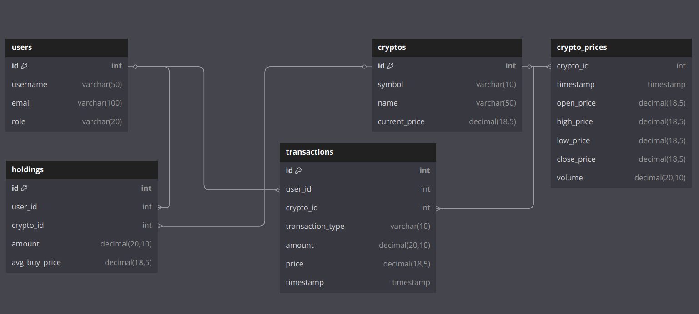

# 虛擬貨幣投資幣種管理系統

## 目錄
- [1. 專案概述](#1-專案概述)
  - [1.1 系統簡介](#11-系統簡介)
  - [1.2 成員自我介紹](#12-成員自我介紹)
- [2. 功能與需求](#2-功能與需求)
  - [2.1 功能特色](#21-功能特色)
  - [2.2 使用者需求](#22-使用者需求)
  - [2.3 系統需求](#23-系統需求)
    - [使用者管理](#使用者管理)
    - [資產管理](#資產管理)
    - [交易紀錄](#交易紀錄)
  - [2.4 使用者案例](#24-使用者案例)
    - [一般使用者（User）](#一般使用者user)
    - [管理員（Admin）](#管理員admin)
    - [超級管理員（Super Admin）](#超級管理員super-admin)
- [3. ER Diagram](#3-er-diagram)
- [4. 資料庫Schema及完整性限制](#4-資料庫schema及完整性限制)
  - [4.1 Schema Diagram](#41-schema-diagram)
  - [4.2 使用者表（users）](#42-使用者表users)
  - [4.3 使用者憑證表（user_credentials）](#43-使用者憑證表user_credentials)
  - [4.4 幣種表（cryptos）](#44-幣種表cryptos)
  - [4.5 歷史價格表（crypto_prices）](#45-歷史價格表crypto_prices)
  - [4.6 持倉表（holdings）](#46-持倉表holdings)
  - [4.7 交易紀錄表（transactions）](#47-交易紀錄表transactions)
- [5. 視圖 (View)](#5-視圖-view)
  - [5.1 使用者管理](#51-使用者管理)
    - [使用者資料視圖（v_user_profile）](#使用者資料視圖v_user_profile)
  - [5.2 資產管理](#52-資產管理)
    - [(1) 持倉概覽視圖（v_user_holdings）](#1-持倉概覽視圖v_user_holdings)
    - [(2) 投資表現視圖（v_user_investment_performance）](#2-投資表現視圖v_user_investment_performance)
  - [5.3 交易紀錄](#53-交易紀錄)
    - [交易歷史視圖（v_user_transactions）](#交易歷史視圖v_user_transactions)
  - [5.4 市場資訊與分析](#54-市場資訊與分析)
    - [(1) 實時行情視圖（v_market_realtime）](#1-實時行情視圖v_market_realtime)
    - [(2) K 線圖視圖（v_kline_data）](#2-k-線圖視圖v_kline_data)
    - [(3) 日平均線視圖（v_daily_sma）](#3-日平均線視圖v_daily_sma)
  - [5.5 視圖總覽與權限](#55-視圖總覽與權限)
- [6. 團隊分工](#6-團隊分工)
- [7. 報告連結](#7-報告連結)
- [8. 參考資料](#8-參考資料)

## 1. 專案概述

### 1.1 系統簡介
本系統為一虛擬貨幣投資管理平台，支援帳號管理、交易記錄、持倉追蹤與市場行情分析，幫助用戶高效管理投資組合。核心功能包括：
- 使用者管理：註冊、登入、權限分級。
- 交易紀錄：記錄買入/賣出交易。
- 資產管理：持倉檢視、盈虧計算、投資報告。
- 市場資訊：實時行情、K 線圖與技術指標。

### 1.2 成員自我介紹

您好！我們是虎尾科技大學四資工三乙的學生，以下是我們專題的成員自我介紹：

* **組長**：王忠仁（[boxcat-none](https://github.com/boxcat-none)）
  **學號**：41143209
  **興趣**：觀看 YouTube 的旅遊、美食影片，並從中學習各種知識。

* **組員**：張家誠（[Adsgfjhk](https://github.com/Adsgfjhk)）
  **學號**：41143231
  **興趣**：閱讀科技與程式設計文章、手遊與打球放鬆。

* **組員**：劉向宏（[liuleo0518](https://github.com/liuleo0518)）
  **學號**：41143248
  **興趣**：打網球（體育績優升學）、現專注於資訊工程。

## 2. 功能與需求

### 2.1 功能特色
- **使用者管理**：帳號註冊、登入、權限設定。
- **交易紀錄**：記錄買入、賣出、交易時間與價格。
- **資產管理**：查看持有幣種、實時價格、盈虧計算、分析報告。

### 2.2 使用者需求
- **註冊與登錄**：透過電子郵件與密碼註冊、登錄，支援密碼重置。
- **個人資料管理**：查看與更新 username、email。
- **交易記錄**：查看買入/賣出歷史。
- **持倉追蹤**：實時查看持倉數量、當前市值、平均買入價格、盈虧。
- **實時行情**：查看幣種價格、24小時漲跌幅。
- **歷史價格**：查看 K 線圖（1小時、4小時、日線），計算技術指標。
- **投資表現**：查看收益、投資分析報告。

### 2.3 系統需求
#### 使用者管理
- 使用者可註冊帳號，提供使用者名稱、電子郵件與密碼。
- 支援電子郵件與密碼登入，區分一般使用者、管理員與超級管理員。
- 使用者可更新個人資料。

#### 資產管理
- 使用者可查看持有的所有幣種及其數量。
- 系統計算每種幣種的盈虧。
- 支援新增或移除持有的幣種。
- 提供投資分析報告。

#### 交易紀錄
- 記錄買入與賣出交易，包含幣種、數量、價格與時間。
- 提供交易歷史查詢功能。

### 2.4 使用者案例
#### 一般使用者（User）
- 帳戶管理：註冊、更新資料、重置密碼。
- 投資組合管理：添加持倉、查看持倉與交易。
- 市場資訊：查看行情、歷史價格分析。

#### 管理員（Admin）
- 用戶管理：查看用戶、禁用帳戶。
- 幣種管理：上架或下架幣種。
- 包含一般使用者功能。

#### 超級管理員（Super Admin）
- 權限管理：創建管理員、修改權限。
- 系統配置：設定 API。
- 包含所有功能。

## 3. ER Diagram


### 關係說明

| 關係            | 關係名稱 | 類型   | 描述                                                                 | 外鍵                        |
|-----------------|----------|--------|----------------------------------------------------------------------|-----------------------------|
| `user` - `holdings` | `own`   | 1:N    | 一個 `user` 可以擁有多個 `holdings`，但每個 `holdings` 只屬於一個 `user`。 | `user_id` 在 `holdings` 中，參照 `user.id` |
| `user` - `transactions` | `trade` | 1:N    | 一個 `user` 可以進行多筆 `transactions`，但每筆 `transactions` 只由一個 `user` 執行。 | `user_id` 在 `transactions` 中，參照 `user.id` |
| `holdings` - `cryptos` | `possess` | N:1    | 多個 `holdings` 可以對應同一個 `cryptos`，但每個 `holdings` 只持有單一 `cryptos`。 | `crypto_id` 在 `holdings` 中，參照 `cryptos.id` |
| `transactions` - `cryptos` | `involve` | N:1    | 多筆 `transactions` 可以涉及同一個 `cryptos`，但每筆 `transactions` 只涉及單一 `cryptos`。 | `crypto_id` 在 `transactions` 中，參照 `cryptos.id` |
| `crypto_prices` - `cryptos` | `track` | N:1    | 多筆 `crypto_prices` 記錄對應同一個 `cryptos`，但每筆 `crypto_prices` 只屬於單一 `cryptos`。 | `crypto_id` 在 `crypto_prices` 中，參照 `cryptos.id` |


## 4. 資料庫Schema及完整性限制

### 4.1 Schema Diagram


### 4.2 使用者表（users）

| 欄位名稱     | 類型      | 描述         |
|--------------|-----------|--------------|
| id           | INT       | 使用者 ID（主鍵） |
| username     | VARCHAR   | 使用者名稱      |
| email        | VARCHAR   | 電子郵件       |
| role         | VARCHAR   | 使用者角色      |

#### 完整性限制說明

| 欄位      | 約束                                      | 是否可重複 | 長度限制                   | 特殊符號限制         | 資料型態         |
|-----------|-------------------------------------------|------------|----------------------------|----------------------|------------------|
| id        | 主鍵（PRIMARY KEY），非空（NOT NULL），自動遞增（AUTO_INCREMENT） | 不可重複   | INT，32 位整數，範圍 1 到 2,147,483,647 | 僅限整數數值    | INT，整數型態，儲存整數值 |
| username  | 非空（NOT NULL）                          | 允許重複   | VARCHAR(50)，最多 50 個字符  | 支援字母、數字、下劃線、連字符 | VARCHAR(50)，可變長度字串 |
| email     | 非空（NOT NULL），唯一（UNIQUE）           | 不可重複   | VARCHAR(100)，最多 100 個字符 | 支援字母、數字、點、連字符、下劃線、@ | VARCHAR(100)，可變長度字串 |
| role      | 非空（NOT NULL），CHECK (role IN ('super_admin', 'admin', 'user')) | 允許重複 | VARCHAR(20)，最多 20 個字符  | 僅限 'super_admin'、'admin'、'user' | VARCHAR(20)，可變長度字串 |

#### SQL
```sql
CREATE TABLE users (
    id INT NOT NULL AUTO_INCREMENT,
    username VARCHAR(50) NOT NULL,
    email VARCHAR(100) NOT NULL,
    role VARCHAR(20) NOT NULL CHECK (role IN ('super_admin', 'admin', 'user')),
    PRIMARY KEY (id),
    UNIQUE (email)
) ENGINE=InnoDB DEFAULT CHARSET=utf8mb4;
```
#### 舉例


```
id | username       | email                     | role
---+---------------+---------------------------+------------
1  | john_doe      | john.doe@example.com      | super_admin
2  | jane_smith    | jane.smith@example.com    | admin
3  | alex_wong     | alex.wong@example.com     | admin
4  | emily_chen    | emily.chen@example.com    | user
5  | michael_lee   | michael.lee@example.com   | user
6  | sarah_kim     | sarah.kim@example.com     | user
7  | david_park    | david.park@example.com    | user
8  | laura_wu      | laura.wu@example.com      | user
9  | chris_tan     | chris.tan@example.com     | user
10 | sophia_liu    | sophia.liu@example.com    | user
```


### 4.3 使用者憑證表（user_credentials）

| 欄位名稱       | 類型      | 描述         |
|----------------|-----------|--------------|
| user_id        | INT       | 使用者 ID（主鍵，外鍵） |
| password_hash  | VARCHAR   | 密碼（加密）     |

#### 完整性限制說明

| 欄位         | 約束                                      | 是否可重複 | 長度限制                   | 特殊符號限制         | 資料型態         |
|--------------|-------------------------------------------|------------|----------------------------|----------------------|------------------|
| user_id      | 主鍵（PRIMARY KEY），非空（NOT NULL），外鍵（FOREIGN KEY REFERENCES users(id) ON DELETE CASCADE） | 不可重複   | INT，32 位整數，範圍 1 到 2,147,483,647 | 僅限整數數值    | INT，整數型態，儲存整數值 |
| password_hash| 非空（NOT NULL）                          | 允許重複   | VARCHAR(255)，最多 255 個字符 | 支援所有字符         | VARCHAR(255)，可變長度字串 |

#### SQL
```sql
-- 使用者憑證表
CREATE TABLE user_credentials (
    user_id INT NOT NULL,
    password_hash VARCHAR(255) NOT NULL,
    PRIMARY KEY (user_id),
    FOREIGN KEY (user_id) REFERENCES users(id) ON DELETE CASCADE
) ENGINE=InnoDB DEFAULT CHARSET=utf8mb4;
```

#### 舉例

```
user_id | password_hash
--------+---------------------- 
1       | hash_123456
2       | hash_789012
3       | hash_345678
4       | hash_901234
5       | hash_567890
6       | hash_234567
7       | hash_890123
8       | hash_456789
9       | hash_012345
10      | hash_678901
```

### 4.4 幣種表（cryptos）

| 欄位名稱       | 類型      | 描述            |
|----------------|-----------|-----------------|
| id             | INT       | 幣種 ID（主鍵）     |
| symbol         | VARCHAR   | 幣種代號（BTC、ETH） |
| name           | VARCHAR   | 幣種名稱          |
| current_price  | DECIMAL   | 當前價格          |

#### 完整性限制說明

| 欄位          | 約束                                      | 是否可重複 | 長度限制                   | 特殊符號限制         | 資料型態         |
|---------------|-------------------------------------------|------------|----------------------------|----------------------|------------------|
| id            | 主鍵（PRIMARY KEY），非空（NOT NULL），自動遞增（AUTO_INCREMENT） | 不可重複   | INT，32 位整數，範圍 1 到 2,147,483,647 | 僅限整數數值    | INT，整數型態，儲存整數值 |
| symbol        | 非空（NOT NULL），唯一（UNIQUE）           | 不可重複   | VARCHAR(10)，最多 10 個字符 | 僅限大寫字母、數字   | VARCHAR(10)，可變長度字串 |
| name          | 非空（NOT NULL）                          | 允許重複   | VARCHAR(50)，最多 50 個字符 | 支援字母、數字、空格、連字符 | VARCHAR(50)，可變長度字串 |
| current_price | 非空（NOT NULL），CHECK (current_price >= 0) | 允許重複   | DECIMAL(18, 5)，總長 18 位，含 5 位小數 | 僅限數字、小數點 | DECIMAL(18, 5)，固定精度十進位數 |

#### SQL
```sql
CREATE TABLE cryptos (
    id INT NOT NULL AUTO_INCREMENT,
    symbol VARCHAR(10) NOT NULL UNIQUE,
    name VARCHAR(50) NOT NULL,
    current_price DECIMAL(18, 5) NOT NULL CHECK (current_price >= 0),
    PRIMARY KEY (id)
) ENGINE=InnoDB DEFAULT CHARSET=utf8mb4;
```

#### 舉例

```
id | symbol | name            | current_price
---+--------+-----------------+---------------
1  | BTC    | Bitcoin         | 65000.75000
2  | ETH    | Ethereum        | 3200.50000
3  | BNB    | Binance Coin    | 620.25000
4  | ADA    | Cardano         | 2.15000
5  | XRP    | Ripple          | 1.05000
6  | SOL    | Solana          | 165.80000
7  | DOT    | Polkadot        | 22.75000
8  | DOGE   | Dogecoin        | 0.40000
9  | MATIC  | Polygon         | 1.35000
10 | LINK   | Chainlink       | 28.90000
11 | SHIB   | Shiba Inu       | 0.00002500
12 | LTC    | Litecoin        | 180.60000
```
### 4.5 歷史價格表（crypto_prices）

| 欄位名稱      | 類型        | 描述              |
|---------------|-------------|-------------------|
| crypto_id     | INT         | 幣種 ID（外鍵）     |
| timestamp     | TIMESTAMP   | 價格記錄時間        |
| open_price    | DECIMAL     | 開盤價            |
| high_price    | DECIMAL     | 最高價            |
| low_price     | DECIMAL     | 最低價            |
| close_price   | DECIMAL     | 收盤價            |
| volume        | DECIMAL     | 交易量            |

#### 完整性限制說明

| 欄位         | 約束                                      | 是否可重複           | 長度限制                            | 特殊符號限制               | 資料型態                     |
|--------------|-------------------------------------------|----------------------|-------------------------------------|----------------------------|------------------------------|
| crypto_id    | 非空（NOT NULL），外鍵（FOREIGN KEY REFERENCES cryptos(id) ON DELETE CASCADE），主鍵的一部分 | 與 timestamp 組合不可重複 | INT，32 位整數，範圍 1 到 2,147,483,647 | 僅限整數數值          | INT，整數型態，儲存整數值     |
| timestamp    | 非空（NOT NULL），主鍵的一部分             | 與 crypto_id 組合不可重複 | TIMESTAMP，範圍 1970-01-01 00:00:01 到 2038-01-19 03:14:07 UTC | 格式 YYYY-MM-DD HH:MM:SS，僅限數字、連字符、冒號、空格 | TIMESTAMP，時間戳型態，儲存日期和時間 |
| open_price   | 非空（NOT NULL），CHECK (open_price >= 0)  | 允許重複             | DECIMAL(18, 5)，總長 18 位，含 5 位小數 | 僅限數字、小數點       | DECIMAL(18, 5)，固定精度十進位數 |
| high_price   | 非空（NOT NULL），CHECK (high_price >= 0)  | 允許重複             | DECIMAL(18, 5)，總長 18 位，含 5 位小數 | 僅限數字、小數點       | DECIMAL(18, 5)，固定精度十進位數 |
| low_price    | 非空（NOT NULL），CHECK (low_price >= 0)   | 允許重複             | DECIMAL(18, 5)，總長 18 位，含 5 位小數 | 僅限數字、小數點       | DECIMAL(18, 5)，固定精度十進位數 |
| close_price  | 非空（NOT NULL），CHECK (close_price >= 0) | 允許重複             | DECIMAL(18, 5)，總長 18 位，含 5 位小數 | 僅限數字、小數點       | DECIMAL(18, 5)，固定精度十進位數 |
| volume       | 非空（NOT NULL），CHECK (volume >= 0)      | 允許重複             | DECIMAL(20, 10)，總長 20 位，含 10 位小數 | 僅限數字、小數點    | DECIMAL(20, 10)，固定精度十進位數 |


#### SQL
```sql
CREATE TABLE crypto_prices (
    crypto_id INT NOT NULL,
    timestamp TIMESTAMP NOT NULL,
    open_price DECIMAL(18, 5) NOT NULL CHECK (open_price >= 0),
    high_price DECIMAL(18, 5) NOT NULL CHECK (high_price >= 0),
    low_price DECIMAL(18, 5) NOT NULL CHECK (low_price >= 0),
    close_price DECIMAL(18, 5) NOT NULL CHECK (close_price >= 0),
    volume DECIMAL(20, 10) NOT NULL CHECK (volume >= 0),
    PRIMARY KEY (crypto_id, timestamp),
    FOREIGN KEY (crypto_id) REFERENCES cryptos(id) ON DELETE CASCADE,
    INDEX idx_timestamp (timestamp)
) ENGINE=InnoDB DEFAULT CHARSET=utf8mb4;
```

#### 舉例
```
crypto_id | timestamp            | open_price  | high_price  | low_price   | close_price | volume
----------+---------------------+-------------+-------------+-------------+-------------+----------------
1         | 2025-06-09 10:00:00 | 64800.50000 | 65100.75000 | 64700.25000 | 65000.30000 | 150.2500000000
1         | 2025-06-09 11:00:00 | 65000.30000 | 65250.00000 | 64950.10000 | 65050.45000 | 180.5000000000
2         | 2025-06-09 10:00:00 | 3180.25000  | 3220.50000  | 3170.75000  | 3200.15000  | 600.0000000000
2         | 2025-06-09 11:00:00 | 3200.15000  | 3230.30000  | 3190.20000  | 3215.45000  | 550.7500000000
3         | 2025-06-09 10:00:00 | 615.75000   | 625.90000   | 610.60000   | 620.30000   | 2500.0000000000
3         | 2025-06-09 11:00:00 | 620.30000   | 630.25000   | 615.10000   | 625.45000   | 2300.5000000000
4         | 2025-06-09 10:00:00 | 2.10000     | 2.18000     | 2.08000     | 2.15000     | 120000.0000000000
4         | 2025-06-09 11:00:00 | 2.15000     | 2.20000     | 2.12000     | 2.18000     | 110000.0000000000
5         | 2025-06-09 10:00:00 | 1.03000     | 1.06000     | 1.01000     | 1.05000     | 600000.0000000000
5         | 2025-06-09 11:00:00 | 1.05000     | 1.08000     | 1.03000     | 1.06000     | 580000.0000000000
6         | 2025-06-09 10:00:00 | 164.50000   | 166.80000   | 163.20000   | 165.30000   | 2000.0000000000
6         | 2025-06-09 11:00:00 | 165.30000   | 167.50000   | 164.10000   | 166.20000   | 1900.5000000000
7         | 2025-06-09 10:00:00 | 22.30000    | 23.00000    | 22.10000    | 22.75000    | 15000.0000000000
7         | 2025-06-09 11:00:00 | 22.75000    | 23.20000    | 22.50000    | 23.00000    | 14000.0000000000
8         | 2025-06-09 10:00:00 | 0.39000     | 0.41000     | 0.38000     | 0.40000     | 1000000.0000000000
8         | 2025-06-09 11:00:00 | 0.40000     | 0.42000     | 0.39000     | 0.41000     | 950000.0000000000
9         | 2025-06-09 10:00:00 | 1.32000     | 1.36000     | 1.30000     | 1.35000     | 80000.0000000000
9         | 2025-06-09 11:00:00 | 1.35000     | 1.38000     | 1.33000     | 1.37000     | 75000.0000000000
10        | 2025-06-09 10:00:00 | 28.50000    | 29.10000    | 28.30000    | 28.90000    | 5000.0000000000
10        | 2025-06-09 11:00:00 | 28.90000    | 29.30000    | 28.70000    | 29.10000    | 4800.0000000000
```

### 4.6 持倉表（holdings）

| 欄位名稱       | 類型      | 描述         |
|----------------|-----------|--------------|
| id             | INT       | 持倉 ID（主鍵） |
| user_id        | INT       | 使用者 ID（外鍵） |
| crypto_id      | INT       | 幣種 ID（外鍵） |
| amount         | DECIMAL   | 持有數量       |
| avg_buy_price  | DECIMAL   | 持倉均價       |

#### 完整性限制說明

| 欄位          | 約束                                      | 是否可重複 | 長度限制                   | 特殊符號限制         | 資料型態         |
|---------------|-------------------------------------------|------------|----------------------------|----------------------|------------------|
| id            | 主鍵（PRIMARY KEY），非空（NOT NULL），自動遞增（AUTO_INCREMENT） | 不可重複   | INT，32 位整數，範圍 1 到 2,147,483,647，從 1 開始 | 僅限整數數值    | INT，整數型態，儲存整數值 |
| user_id       | 非空（NOT NULL），外鍵（FOREIGN KEY REFERENCES users(id) ON DELETE CASCADE） | 允許重複   | INT，與 users.id 一致      | 僅限整數數值    | INT，整數型態，儲存整數值 |
| crypto_id     | 非空（NOT NULL），外鍵（FOREIGN KEY REFERENCES cryptos(id) ON DELETE CASCADE） | 允許重複   | INT，與 cryptos.id 一致    | 僅限整數數值    | INT，整數型態，儲存整數值 |
| amount        | 非空（NOT NULL），CHECK (amount >= 0)      | 允許重複   | DECIMAL(20, 10)，總長 20 位，含 10 位小數 | 僅限數字、小數點 | DECIMAL(20, 10)，固定精度十進位數 |
| avg_buy_price | 非空（NOT NULL），CHECK (avg_buy_price >= 0) | 允許重複   | DECIMAL(18, 5)，總長 18 位，含 5 位小數 | 僅限數字、小數點 | DECIMAL(18, 5)，固定精度十進位數 |

#### SQL
```sql
CREATE TABLE holdings (
    id INT NOT NULL AUTO_INCREMENT,
    user_id INT NOT NULL,
    crypto_id INT NOT NULL,
    amount DECIMAL(20, 10) NOT NULL CHECK (amount >= 0),
    avg_buy_price DECIMAL(18, 5) NOT NULL CHECK (avg_buy_price >= 0),
    PRIMARY KEY (id),
    FOREIGN KEY (user_id) REFERENCES users(id) ON DELETE CASCADE,
    FOREIGN KEY (crypto_id) REFERENCES cryptos(id) ON DELETE CASCADE
) ENGINE=InnoDB DEFAULT CHARSET=utf8mb4;
```

#### 舉例

```
id | user_id | crypto_id | amount           | avg_buy_price
---+---------+-----------+-----------------+---------------
1  | 1       | 1         | 0.3000000000    | 64000.00000
2  | 2       | 2         | 8.0000000000    | 3100.00000
3  | 3       | 3         | 12.0000000000   | 600.00000
4  | 4       | 4         | 800.0000000000  | 2.00000
5  | 5       | 5         | 4000.0000000000 | 1.00000
6  | 6       | 6         | 15.0000000000   | 160.00000
7  | 7       | 7         | 40.0000000000   | 22.00000
8  | 8       | 8         | 8000.0000000000 | 0.38000
9  | 9       | 9         | 600.0000000000  | 1.30000
10 | 10      | 10        | 30.0000000000   | 28.00000
11 | 4       | 2         | 5.0000000000    | 3150.00000
12 | 5       | 1         | 0.2000000000    | 64500.00000
13 | 6       | 3         | 10.0000000000   | 610.00000
14 | 7       | 4         | 500.0000000000  | 2.10000
15 | 8       | 5         | 3000.0000000000 | 1.02000
```

### 4.7 交易紀錄表（transactions）

| 欄位名稱         | 類型        | 描述         |
|------------------|-------------|--------------|
| id               | INT         | 交易 ID（主鍵） |
| user_id          | INT         | 使用者 ID（外鍵） |
| crypto_id        | INT         | 幣種 ID（外鍵） |
| transaction_type | VARCHAR     | 交易類型（買/賣） |
| amount           | DECIMAL     | 交易數量       |
| price            | DECIMAL     | 交易價格       |
| timestamp        | TIMESTAMP   | 交易時間       |

#### 完整性限制說明

| 欄位           | 約束                                      | 是否可重複 | 長度限制                   | 特殊符號限制               | 資料型態                     |
|----------------|-------------------------------------------|------------|----------------------------|----------------------------|------------------------------|
| id             | 主鍵（PRIMARY KEY），非空（NOT NULL），自動遞增（AUTO_INCREMENT） | 不可重複   | INT，32 位整數，範圍 1 到 2,147,483,647 | 僅限整數數值          | INT，整數型態，儲存整數值     |
| user_id        | 非空（NOT NULL），外鍵（FOREIGN KEY REFERENCES users(id) ON DELETE CASCADE） | 允許重複   | INT，與 users.id 一致      | 僅限整數數值          | INT，整數型態，儲存整數值     |
| crypto_id      | 非空（NOT NULL），外鍵（FOREIGN KEY REFERENCES cryptos(id) ON DELETE CASCADE） | 允許重複   | INT，與 cryptos.id 一致    | 僅限整數數值          | INT，整數型態，儲存整數值     |
| transaction_type | 非空（NOT NULL），CHECK (transaction_type IN ('buy', 'sell')) | 允許重複   | VARCHAR(10)，最多 10 個字符 | 僅限 "buy" 或 "sell"   | VARCHAR(10)，可變長度字串     |
| amount         | 非空（NOT NULL），CHECK (amount > 0)       | 允許重複   | DECIMAL(20, 10)，總長 20 位，含 10 位小數 | 僅限數字、小數點       | DECIMAL(20, 10)，固定精度十進位數 |
| price          | 非空（NOT NULL），CHECK (price >= 0)       | 允許重複   | DECIMAL(18, 5)，總長 18 位，含 5 位小數 | 僅限數字、小數點       | DECIMAL(18, 5)，固定精度十進位數 |
| timestamp      | 非空（NOT NULL），DEFAULT CURRENT_TIMESTAMP | 允許重複   | TIMESTAMP，範圍 1970-01-01 00:00:01 到 2038-01-19 03:14:07 UTC | 格式 YYYY-MM-DD HH:MM:SS，僅限數字、連字符、冒號、空格 | TIMESTAMP，時間戳型態，儲存日期和時間 |

#### SQL
```sql
CREATE TABLE transactions (
    id INT NOT NULL AUTO_INCREMENT,
    user_id INT NOT NULL,
    crypto_id INT NOT NULL,
    transaction_type VARCHAR(10) NOT NULL CHECK (transaction_type IN ('buy', 'sell')),
    amount DECIMAL(20, 10) NOT NULL CHECK (amount > 0),
    price DECIMAL(18, 5) NOT NULL CHECK (price >= 0),
    timestamp TIMESTAMP NOT NULL DEFAULT CURRENT_TIMESTAMP,
    PRIMARY KEY (id),
    FOREIGN KEY (user_id) REFERENCES users(id) ON DELETE CASCADE,
    FOREIGN KEY (crypto_id) REFERENCES cryptos(id) ON DELETE CASCADE
) ENGINE=InnoDB DEFAULT CHARSET=utf8mb4;
```

#### 舉例

```
id | user_id | crypto_id | transaction_type | amount           | price       | timestamp
---+---------+-----------+------------------+-----------------+-------------+-------------------------
1  | 1       | 1         | buy              | 0.3000000000    | 64000.00000 | 2025-06-01 09:00:00
2  | 2       | 2         | buy              | 8.0000000000    | 3100.00000  | 2025-06-01 10:00:00
3  | 3       | 3         | buy              | 12.0000000000   | 600.00000   | 2025-06-02 11:00:00
4  | 4       | 4         | buy              | 800.0000000000  | 2.00000     | 2025-06-02 12:00:00
5  | 5       | 5         | buy              | 4000.0000000000 | 1.00000     | 2025-06-03 13:00:00
6  | 6       | 6         | buy              | 15.0000000000   | 160.00000   | 2025-06-03 14:00:00
7  | 7       | 7         | buy              | 40.0000000000   | 22.00000    | 2025-06-04 15:00:00
8  | 8       | 8         | buy              | 8000.0000000000 | 0.38000     | 2025-06-04 16:00:00
9  | 9       | 9         | buy              | 600.0000000000  | 1.30000     | 2025-06-05 17:00:00
10 | 10      | 10        | buy              | 30.0000000000   | 28.00000    | 2025-06-05 18:00:00
11 | 4       | 2         | sell             | 2.0000000000    | 3200.00000  | 2025-06-06 09:00:00
12 | 5       | 1         | buy              | 0.2000000000    | 64500.00000 | 2025-06-06 10:00:00
13 | 6       | 3         | sell             | 5.0000000000    | 620.00000   | 2025-06-07 11:00:00
14 | 7       | 4         | buy              | 500.0000000000  | 2.10000     | 2025-06-07 12:00:00
15 | 8       | 5         | buy              | 3000.0000000000 | 1.02000     | 2025-06-08 13:00:00
```
## 5. 視圖 (View)

### 5.1 使用者管理

#### 需求
- **註冊與登錄**：支援電子郵件與密碼註冊、登錄，包含密碼重置功能。
- **個人資料管理**：允許使用者查看與更新 username、email。
- **角色區分**：支援一般使用者、管理員與超級管理員的權限分級。

#### 使用者資料視圖（v_user_profile）

- **用途**：
  - 允許使用者查看和更新個人資料（username、email）。
  - 管理員和超級管理員可檢視所有用戶資料，進行角色管理或用戶監控。
- **基於表**：`users`
- **欄位**：
  - user_id (INT)：用戶 ID
  - username (VARCHAR)：使用者名稱
  - email (VARCHAR)：電子郵件
  - role (VARCHAR)：角色（user、admin、super_admin）
- **SQL**：
  ```sql
  CREATE VIEW v_user_profile AS
  SELECT 
      id AS user_id,
      username,
      email,
      role
  FROM users;
  ```
- **應用場景**：
  - **一般使用者**：查看個人資料：
    ```sql
    SELECT * FROM v_user_profile WHERE user_id = 4;
    ```
    **範例結果**：
    ```
    user_id | username    | email                  | role
    --------+------------+------------------------+------
    4       | emily_chen | emily.chen@example.com | user
    ```
    **說明**：使用者 `emily_chen` 查看自己的 username、email 和角色，用於個人資料頁面顯示或更新。
  - **管理員**：檢視普通用戶清單：
    ```sql
    SELECT * FROM v_user_profile WHERE role = 'user';
    ```
    **範例結果**：
    ```
    user_id | username      | email                     | role
    --------+---------------+---------------------------+------
    4       | emily_chen    | emily.chen@example.com    | user
    5       | michael_lee   | michael.lee@example.com   | user
    6       | sarah_kim     | sarah.kim@example.com     | user
    7       | david_park    | david.park@example.com    | user
    8       | laura_wu      | laura.wu@example.com      | user
    9       | chris_tan     | chris.tan@example.com     | user
    10      | sophia_liu    | sophia.liu@example.com    | user
    ```
    **說明**：管理員篩選所有普通用戶，檢查用戶狀態或進行批量操作。
- **說明**：
  - 簡化個人資料查詢，隱藏底層結構，符合個人資料管理需求。
  - 支援權限分級存取，方便角色管理。

### 5.2 資產管理

#### 需求
- 查看當前持有的所有幣種及其數量。
- 計算每種投資幣種的盈虧。
- 新增或移除持有的幣種。
- 查看投資分析報告。

#### (1) 持倉概覽視圖（v_user_holdings）

- **用途**：
  - 為使用者顯示持倉詳情，包括持有數量、市值和盈虧。
  - 管理員可監控用戶持倉，識別高價值投資或異常持倉。
- **基於表**：`holdings`、`cryptos`
- **欄位**：
  - user_id (INT)：用戶 ID
  - crypto_id (INT)：幣種 ID
  - symbol (VARCHAR)：幣種代號
  - amount (DECIMAL(20,10))：持倉數量
  - avg_buy_price (DECIMAL(18,5))：平均買入價格
  - current_price (DECIMAL(18,5))：當前價格
  - market_value (DECIMAL(20,10))：市值
  - profit_loss (DECIMAL(20,10))：盈虧
- **SQL**：
  ```sql
  CREATE VIEW v_user_holdings AS
  SELECT 
      h.user_id,
      h.crypto_id,
      c.symbol,
      h.amount,
      h.avg_buy_price,
      c.current_price,
      ROUND(h.amount * c.current_price, 10) AS market_value,
      ROUND(h.amount * (c.current_price - h.avg_buy_price), 10) AS profit_loss
  FROM holdings h
  JOIN cryptos c ON h.crypto_id = c.id;
  ```
- **應用場景**：
  - **一般使用者**：查看個人持倉：
    ```sql
    SELECT * FROM v_user_holdings WHERE user_id = 4 ORDER BY market_value DESC;
    ```
    **範例結果**：
    ```
    user_id | crypto_id | symbol | amount         | avg_buy_price | current_price | market_value     | profit_loss
    --------+-----------+--------+---------------+---------------+---------------+------------------+-------------
    4       | 2         | ETH    | 5.0000000000  | 3150.00000    | 3200.50000    | 16002.5000000000 | 252.5000000000
    4       | 4         | ADA    | 800.0000000000| 2.00000       | 2.15000       | 1720.0000000000  | 120.0000000000
    ```
    **說明**：使用者 `emily_chen` 持有 ETH 和 ADA，市值分別為 16002.50 USD 和 1720 USD，盈虧分別為 252.50 USD 和 120 USD。
  - **管理員**：監控大額持倉：
    ```sql
    SELECT * FROM v_user_holdings WHERE market_value > 10000;
    ```
    **範例結果**：
    ```
    user_id | crypto_id | symbol | amount         | avg_buy_price | current_price | market_value     | profit_loss
    --------+-----------+--------+---------------+---------------+---------------+------------------+-------------
    1       | 1         | BTC    | 0.3000000000  | 64000.00000   | 65000.75000   | 19500.2250000000 | 300.2250000000
    2       | 2         | ETH    | 8.0000000000  | 3100.00000    | 3200.50000    | 25604.0000000000 | 804.0000000000
    4       | 2         | ETH    | 5.0000000000  | 3150.00000    | 3200.50000    | 16002.5000000000 | 252.5000000000
    5       | 1         | BTC    | 0.2000000000  | 64500.00000   | 65000.75000   | 13000.1500000000 | 100.1500000000
    ```
    **說明**：管理員篩選市值超過 10000 USD 的持倉，檢查高價值投資。
- **說明**：
  - 整合持倉與行情數據，計算市值與盈虧，滿足持倉追蹤需求。
  - 支援新增/移除幣種操作，簡化報告生成。

#### (2) 投資表現視圖（v_user_investment_performance）

- **用途**：
  - 提供投資表現分析，計算當前盈虧、歷史盈虧和投資回報率（ROI）。
  - 管理員可分析用戶投資表現，生成統計報告。
- **基於表**：`holdings`、`cryptos`、`crypto_prices`
- **欄位**：
  - user_id (INT)：用戶 ID
  - crypto_id (INT)：幣種 ID
  - symbol (VARCHAR)：幣種代號
  - amount (DECIMAL(20,10))：持倉數量
  - avg_buy_price (DECIMAL(18,5))：平均買入價格
  - current_price (DECIMAL(18,5))：當前價格
  - historical_price (DECIMAL(18,5))：歷史價格（30 天前）
  - current_profit (DECIMAL(20,10))：當前盈虧
  - historical_profit (DECIMAL(20,10))：歷史盈虧
  - roi (DECIMAL(10,2))：投資回報率（%）
- **SQL**：
  ```sql
  CREATE VIEW v_user_investment_performance AS
  SELECT 
      h.user_id,
      h.crypto_id,
      c.symbol,
      h.amount,
      h.avg_buy_price,
      c.current_price,
      COALESCE((
          SELECT close_price 
          FROM crypto_prices 
          WHERE crypto_id = h.crypto_id 
          AND timestamp = DATE_SUB(CURDATE(), INTERVAL 30 DAY)
          LIMIT 1
      ), c.current_price) AS historical_price,
      ROUND(h.amount * (c.current_price - h.avg_buy_price), 10) AS current_profit,
      ROUND(h.amount * (COALESCE((
          SELECT close_price 
          FROM crypto_prices 
          WHERE crypto_id = h.crypto_id 
          AND timestamp = DATE_SUB(CURDATE(), INTERVAL 30 DAY)
          LIMIT 1
      ), c.current_price) - h.avg_buy_price), 10) AS historical_profit,
      ROUND(
          (h.amount * (c.current_price - h.avg_buy_price)) / 
          (h.amount * h.avg_buy_price) * 100, 
          2
      ) AS roi
  FROM holdings h
  JOIN cryptos c ON h.crypto_id = c.id;
  ```
- **應用場景**：
  - **一般使用者**：查看投資表現：
    ```sql
    SELECT * FROM v_user_investment_performance WHERE user_id = 2;
    ```
    **範例結果**（假設 30 天前 ETH 收盤價為 3000.00000）：
    ```
    user_id | crypto_id | symbol | amount        | avg_buy_price | current_price | historical_price | current_profit | historical_profit | roi
    --------+-----------+--------+--------------+---------------+---------------+------------------+---------------+------------------+------
    2       | 2         | ETH    | 8.0000000000 | 3100.00000    | 3200.50000    | 3000.00000       | 804.0000000000 | -800.0000000000  | 3.24
    ```
    **說明**：使用者 `jane_smith` 持有 8 ETH，當前盈虧 804 USD，30 天前盈虧 -800 USD，ROI 為 3.24%。
  - **管理員**：分析投資表現：
    ```sql
    SELECT user_id, SUM(current_profit) AS total_profit, AVG(roi) AS avg_roi
    FROM v_user_investment_performance 
    GROUP BY user_id;
    ```
    **範例結果**（簡化假設部分數據）：
    ```
    user_id | total_profit     | avg_roi
    --------+-----------------+--------
    1       | 300.2250000000  | 1.56
    2       | 804.0000000000  | 3.24
    3       | 243.0000000000  | 3.37
    4       | 372.5000000000  | 3.93
    5       | 250.1500000000  | 2.45
    6       | 87.0000000000   | 3.62
    7       | 80.0000000000   | 2.86
    8       | 180.0000000000  | 3.15
    ```
    **說明**：管理員查看每個用戶的總盈虧和平均 ROI，識別高回報用戶或潛在風險。
- **說明**：
  - 計算當前與歷史收益，支援 ROI 分析，滿足投資表現需求。
  - 提供自訂時間範圍的基礎，簡化報告生成邏輯。

### 5.3 交易紀錄

#### 需求
- 記錄買入與賣出交易（幣種、數量、價格、時間）。
- 提供交易歷史查詢功能。

#### 交易歷史視圖（v_user_transactions）

- **用途**：
  - 為使用者提供交易歷史查詢，顯示買入/賣出詳情。
  - 管理員監控交易活動，特別是大額或異常交易。
- **基於表**：`transactions`、`cryptos`、`users`
- **欄位**：
  - transaction_id (INT)：交易 ID
  - user_id (INT)：用戶 ID
  - username (VARCHAR)：使用者名稱
  - crypto_id (INT)：幣種 ID
  - symbol (VARCHAR)：幣種代號
  - transaction_type (VARCHAR)：交易類型
  - amount (DECIMAL(20,10))：交易數量
  - price (DECIMAL(18,5))：交易價格
  - total_cost (DECIMAL(20,10))：總成本
  - timestamp (TIMESTAMP)：交易時間
- **SQL**：
  ```sql
  CREATE VIEW v_user_transactions AS
  SELECT 
      t.id AS transaction_id,
      t.user_id,
      u.username,
      t.crypto_id,
      c.symbol,
      t.transaction_type,
      t.amount,
      t.price,
      ROUND(t.amount * t.price, 10) AS total_cost,
      t.timestamp
  FROM transactions t
  JOIN users u ON t.user_id = u.id
  JOIN cryptos c ON t.crypto_id = c.id;
  ```
- **應用場景**：
  - **一般使用者**：查看近期交易：
    ```sql
    SELECT * FROM v_user_transactions 
    WHERE user_id = 4 AND timestamp BETWEEN '2025-06-01' AND '2025-06-08'
    ORDER BY timestamp DESC;
    ```
    **範例結果**：
    ```
    transaction_id | user_id | username    | crypto_id | symbol | transaction_type | amount         | price     | total_cost      | timestamp
    --------------+---------+------------+-----------+--------+-----------------+---------------+-----------+----------------+-------------------------
    11            | 4       | emily_chen | 2         | ETH    | sell            | 2.0000000000  | 3200.00000| 6400.0000000000 | 2025-06-06 09:00:00
    4             | 4       | emily_chen | 4         | ADA    | buy             | 800.0000000000| 2.00000   | 1600.0000000000 | 2025-06-02 12:00:00
    ```
    **說明**：使用者 `emily_chen` 查看 6 月初的交易記錄，包含買入 800 ADA 和賣出 2 ETH。
  - **管理員**：監控大額交易：
    ```sql
    SELECT * FROM v_user_transactions 
    WHERE total_cost > 10000 
    ORDER BY timestamp DESC;
    ```
    **範例結果**：
    ```
    transaction_id | user_id | username    | crypto_id | symbol | transaction_type | amount        | price      | total_cost      | timestamp
    --------------+---------+------------+-----------+--------+-----------------+--------------+------------+----------------+-------------------------
    12            | 5       | michael_lee| 1         | BTC    | buy             | 0.2000000000 | 64500.00000| 12900.0000000000 | 2025-06-06 10:00:00
    1             | 1       | john_doe   | 1         | BTC    | buy             | 0.3000000000 | 64000.00000| 19200.0000000000 | 2025-06-01 09:00:00
    ```
    **說明**：管理員篩選總成本超過 10000 USD 的交易，監控大額買賣行為。
- **說明**：
  - 整合交易與用戶、幣種資訊，計算總成本，滿足交易查詢需求。
  - 支援管理員監控大額交易，符合權限設定。

### 5.4 市場資訊與分析

#### 需求
- **實時行情**：查看幣種價格、24 小時漲跌幅。
- **歷史價格**：查看 K 線圖（1 小時、4 小時、日線），計算技術指標。

#### (1) 實時行情視圖（v_market_realtime）

- **用途**：
  - 提供即時幣種價格和 24 小時漲跌幅，供使用者參考交易決策。
  - 管理員監控市場動態，識別異常波動。
- **基於表**：`cryptos`、`crypto_prices`
- **欄位**：
  - crypto_id (INT)：幣種 ID
  - symbol (VARCHAR)：幣種代號
  - name (VARCHAR)：幣種名稱
  - current_price (DECIMAL(18,5))：當前價格
  - price_24h_ago (DECIMAL(18,5))：24 小時前價格
  - price_change_24h (DECIMAL(10,2))：漲跌幅（%）
- **SQL**：
  ```sql
  CREATE VIEW v_market_realtime AS
  SELECT 
      c.id AS crypto_id,
      c.symbol,
      c.name,
      c.current_price,
      COALESCE((
          SELECT close_price 
          FROM crypto_prices 
          WHERE crypto_id = c.id 
          AND timestamp = DATE_SUB(NOW(), INTERVAL 24 HOUR)
          LIMIT 1
      ), c.current_price) AS price_24h_ago,
      ROUND(
          ((c.current_price - COALESCE((
              SELECT close_price 
              FROM crypto_prices 
              WHERE crypto_id = c.id 
              AND timestamp = DATE_SUB(NOW(), INTERVAL 24 HOUR)
              LIMIT 1
          ), c.current_price)) / 
          COALESCE((
              SELECT close_price 
              FROM crypto_prices 
              WHERE crypto_id = c.id 
              AND timestamp = DATE_SUB(NOW(), INTERVAL 24 HOUR)
              LIMIT 1
          ), c.current_price)) * 100, 
          2
      ) AS price_change_24h
  FROM cryptos c;
  ```
- **應用場景**：
  - **一般使用者**：查看市場行情：
    ```sql
    SELECT * FROM v_market_realtime ORDER BY price_change_24h DESC;
    ```
    **範例結果**（假設 24 小時前價格：BTC=64000, ETH=3100, BNB=600）：
    ```
    crypto_id | symbol | name            | current_price | price_24h_ago | price_change_24h
    ----------+--------+-----------------+---------------+---------------+-----------------
    1         | BTC    | Bitcoin         | 65000.75000   | 64000.00000   | 1.56
    2         | ETH    | Ethereum        | 3200.50000    | 3100.00000    | 3.24
    3         | BNB    | Binance Coin    | 620.25000     | 600.00000     | 3.38
    4         | ADA    | Cardano         | 2.15000       | 2.15000       | 0.00
    5         | XRP    | Ripple          | 1.05000       | 1.05000       | 0.00
    6         | SOL    | Solana          | 165.80000     | 165.80000     | 0.00
    7         | DOT    | Polkadot        | 22.75000      | 22.75000      | 0.00
    8         | DOGE   | Dogecoin        | 0.40000       | 0.40000       | 0.00
    9         | MATIC  | Polygon         | 1.35000       | 1.35000       | 0.00
    10        | LINK   | Chainlink       | 28.90000      | 28.90000      | 0.00
    11        | SHIB   | Shiba Inu       | 0.00002500    | 0.00002500    | 0.00
    12        | LTC    | Litecoin        | 180.60000     | 180.60000     | 0.00
    ```
    **說明**：使用者查看所有幣種的當前價格和 24 小時漲跌幅，BNB 漲幅最高（3.38%）。
  - **管理員**：監控劇烈波動：
    ```sql
    SELECT * FROM v_market_realtime WHERE ABS(price_change_24h) > 3;
    ```
    **範例結果**：
    ```
    crypto_id | symbol | name            | current_price | price_24h_ago | price_change_24h
    ----------+--------+-----------------+---------------+---------------+-----------------
    2         | ETH    | Ethereum        | 3200.50000    | 3100.00000    | 3.24
    3         | BNB    | Binance Coin    | 620.25000     | 600.00000     | 3.38
    ```
    **說明**：管理員篩選漲跌幅超過 3% 的幣種，關注市場異常。
- **說明**：
  - 計算 24 小時漲跌幅，滿足實時行情需求。
  - 支援排序與篩選，方便識別市場動態。

#### (2) K 線圖視圖（v_kline_data）

- **用途**：
  - 提供歷史價格數據，支援 K 線圖生成和技術指標計算。
  - 管理員分析市場趨勢，評估交易量。
- **基於表**：`crypto_prices`、`cryptos`
- **欄位**：
  - crypto_id (INT)：幣種 ID
  - symbol (VARCHAR)：幣種代號
  - timestamp (TIMESTAMP)：時間點
  - open_price (DECIMAL(18,5))：開盤價
  - high_price (DECIMAL(18,5))：最高價
  - low_price (DECIMAL(18,5))：最低價
  - close_price (DECIMAL(18,5))：收盤價
  - volume (DECIMAL(20,10))：交易量
- **SQL**：
  ```sql
  CREATE VIEW v_kline_data AS
  SELECT 
      cp.crypto_id,
      c.symbol,
      cp.timestamp,
      cp.open_price,
      cp.high_price,
      cp.low_price,
      cp.close_price,
      cp.volume
  FROM crypto_prices cp
  JOIN cryptos c ON cp.crypto_id = c.id;
  ```
- **應用場景**：
  - **一般使用者**：生成 K 線圖：
    ```sql
    SELECT * FROM v_kline_data 
    WHERE crypto_id = 1 AND timestamp >= '2025-06-09' 
    ORDER BY timestamp;
    ```
    **範例結果**：
    ```
    crypto_id | symbol | timestamp            | open_price  | high_price  | low_price   | close_price | volume
    ----------+--------+---------------------+-------------+-------------+-------------+-------------+----------------
    1         | BTC    | 2025-06-09 10:00:00 | 64800.50000 | 65100.75000 | 64700.25000 | 65000.30000 | 150.2500000000
    1         | BTC    | 2025-06-09 11:00:00 | 65000.30000 | 65250.00000 | 64950.10000 | 65050.45000 | 180.5000000000
    ```
    **說明**：使用者查詢 BTC 的歷史價格，生成 1 小時 K 線圖。
  - **管理員**：分析交易量：
    ```sql
    SELECT symbol, AVG(volume) AS avg_volume 
    FROM v_kline_data 
    WHERE timestamp >= DATE_SUB(NOW(), INTERVAL 7 DAY)
    GROUP BY crypto_id, symbol;
    ```
    **範例結果**：
    ```
    symbol | avg_volume
    -------+--------------------
    BTC    | 165.3750000000
    ETH    | 575.3750000000
    BNB    | 2400.2500000000
    ADA    | 115000.0000000000
    XRP    | 590000.0000000000
    SOL    | 1950.2500000000
    DOT    | 14500.0000000000
    DOGE   | 975000.0000000000
    MATIC  | 77500.0000000000
    LINK   | 4900.0000000000
    ```
    **說明**：管理員計算過去 7 天的平均交易量，DOGE 和 XRP 交易量較高。
- **說明**：
  - 支援 K 線圖與技術指標，滿足歷史價格需求。
  - 提供交易量分析，幫助管理員評估市場活躍度。

#### (3) 日平均線視圖（v_daily_sma）

- **用途**：
  - 提供每日收盤價數據及 7 天、14 天、30 天簡單移動平均線（SMA），支援日平均線圖的繪製。
  - 管理員分析市場趨勢，評估長期或短期價格平滑趨勢。
- **基於表**：`crypto_prices`、`cryptos`
- **欄位**：
  - crypto_id (INT)：幣種 ID
  - symbol (VARCHAR)：幣種代號
  - date (DATE)：日期
  - close_price (DECIMAL(18,5))：當日收盤價
  - sma_7 (DECIMAL(18,5))：7 天簡單移動平均線
  - sma_14 (DECIMAL(18,5))：14 天簡單移動平均線
  - sma_30 (DECIMAL(18,5))：30 天簡單移動平均線
- **SQL**：
  ```sql
  CREATE VIEW v_daily_sma AS
  SELECT 
      cp.crypto_id,
      c.symbol,
      DATE(cp.timestamp) AS date,
      MAX(cp.close_price) AS close_price,
      AVG(cp.close_price) OVER (
          PARTITION BY cp.crypto_id 
          ORDER BY DATE(cp.timestamp)
          ROWS BETWEEN 6 PRECEDING AND CURRENT ROW
      ) AS sma_7,
      AVG(cp.close_price) OVER (
          PARTITION BY cp.crypto_id 
          ORDER BY DATE(cp.timestamp)
          ROWS BETWEEN 13 PRECEDING AND CURRENT ROW
      ) AS sma_14,
      AVG(cp.close_price) OVER (
          PARTITION BY cp.crypto_id 
          ORDER BY DATE(cp.timestamp)
          ROWS BETWEEN 29 PRECEDING AND CURRENT ROW
      ) AS sma_30
  FROM crypto_prices cp
  JOIN cryptos c ON cp.crypto_id = c.id
  WHERE HOUR(cp.timestamp) = 23 AND MINUTE(cp.timestamp) = 59
  GROUP BY cp.crypto_id, c.symbol, DATE(cp.timestamp);
  ```
- **應用場景**：
  - **一般使用者**：生成日平均線圖：
    ```sql
    SELECT * FROM v_daily_sma 
    WHERE crypto_id = 1 AND date >= '2025-06-09' 
    ORDER BY date;
    ```
    **範例結果**：
    ```
    crypto_id | symbol | date       | close_price | sma_7      | sma_14     | sma_30
    ----------+--------+------------+-------------+------------+------------+------------
    1         | BTC    | 2025-06-09 | 65000.30000 | 64500.25000| 64000.75000| 63500.50000
    1         | BTC    | 2025-06-10 | 65100.45000 | 64600.40000| 64100.90000| 63600.60000
    ```
    **說明**：使用者查詢 BTC 的日線數據與 7 天、14 天、30 天 SMA，用於繪製日平均線圖，分析價格趨勢。
  - **管理員**：分析多幣種 SMA 趨勢：
    ```sql
    SELECT symbol, AVG(sma_30) AS avg_sma_30 
    FROM v_daily_sma 
    WHERE date >= DATE_SUB(CURDATE(), INTERVAL 7 DAY)
    GROUP BY crypto_id, symbol;
    ```
    **範例結果**：
    ```
    symbol | avg_sma_30
    -------+------------
    BTC    | 63500.50000
    ETH    | 3100.75000
    BNB    | 600.25000
    ADA    | 2.10000
    XRP    | 1.03000
    SOL    | 160.50000
    DOT    | 22.30000
    DOGE   | 0.39000
    MATIC  | 1.32000
    LINK   | 28.50000
    ```
    **說明**：管理員計算過去 7 天各幣種的 30 天 SMA 平均值，評估市場長期趨勢。
- **說明**：
  - 支援日平均線圖繪製與技術分析，滿足歷史價格趨勢需求。
  - 提供 SMA 數據，幫助管理員評估市場穩定性與趨勢。

### 5.5 視圖總覽與權限

| 視圖名稱                     | 功能需求         | 適用角色                     | 基於表                        |
|------------------------------|------------------|------------------------------|-------------------------------|
| v_user_profile              | 使用者管理       | User, Admin, Super Admin     | users                         |
| v_user_holdings             | 資產管理         | User, Admin, Super Admin     | holdings, cryptos             |
| v_user_investment_performance | 資產管理       | User, Admin, Super Admin     | holdings, cryptos, crypto_prices |
| v_user_transactions         | 交易紀錄         | User, Admin, Super Admin     | transactions, users, cryptos  |
| v_market_realtime           | 市場資訊與分析   | User, Admin, Super Admin     | cryptos, crypto_prices        |
| v_kline_data                | 市場資訊與分析   | User, Admin, Super Admin     | crypto_prices, cryptos        |
| v_daily_sma                 | 市場資訊與分析   | User, Admin, Super Admin     | crypto_prices, cryptos        |

## 6. 團隊分工

* **組長**：王忠仁（[boxcat-none](https://github.com/boxcat-none)）
  **工作內容**：全部

* **組員**：張家誠（[Adsgfjhk](https://github.com/Adsgfjhk)）
 ：Schema Diagram、功能特色、系統需求、完整性限制說明

* **組員**：劉向宏（[liuleo0518](https://github.com/liuleo0518)）
  **工作內容**：資料庫結構、舉例、完整性限制說明、ER Diagram
---

## 7. 報告連結
- **線上期末報告WORD**:https://nfuedu-my.sharepoint.com/:w:/g/personal/41143231_nfu_edu_tw/EUm599hBQENMkZVCvDX-52oBe6sfP8zb4xO99x5_HHQ1Iw?e=U0ZOfv
- [DB期末報告.word](DB期末報告_.docx)
- [DB期末報告.pdf](DB期末報告.pdf)
- **線上期末簡報PPT**:[https://nfuedu-my.sharepoint.com/:w:/g/personal/41143231_nfu_edu_tw/EUm599hBQENMkZVCvDX-52oBe6sfP8zb4xO99x5_HHQ1Iw?e=U0ZOfv](https://www.canva.com/design/DAGpWfQl5bU/o1DjUeVFEnktsXruYnKdWA/edit?utm_content=DAGpWfQl5bU&utm_campaign=designshare&utm_medium=link2&utm_source=sharebutton).
 - [PPT期末報告檔案.pdf](DB期末專題.pdf)
 - [PPT期末報告檔案.pptx](DB期末報告.pptx)
---
## 8. 參考資料
* 使用Grok完成部分說明
