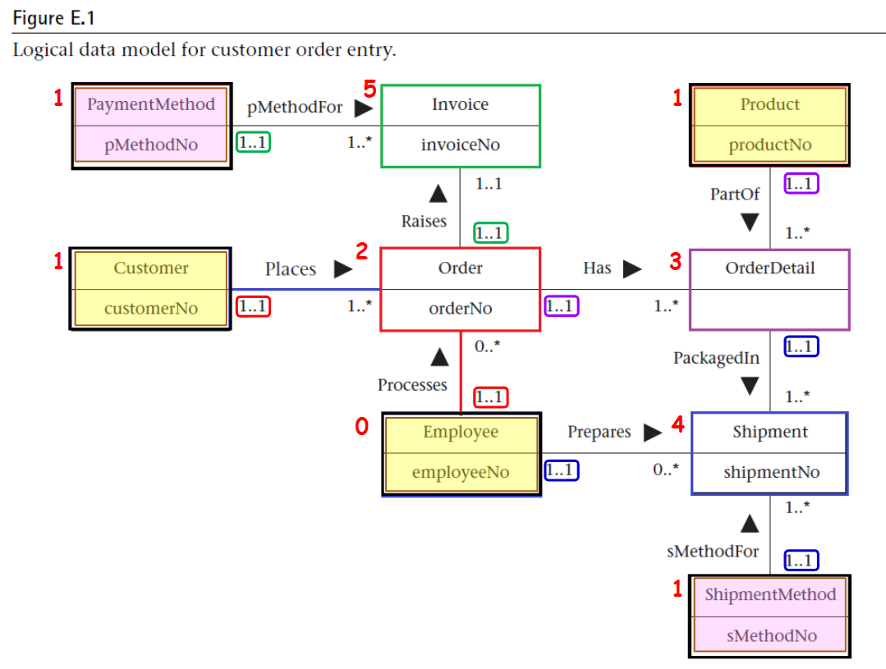

## 作業一

### Customer Table
**Schema**: customerNo, customerName, customerStreet, customerCity, customerState, customerZipCode, custTelNo, custFaxNo, DOB, maritalStatus, creditRating  
**Primary Key**: customerNo  
**Alternate Keys**: custTelNo, custFaxNo

| customerNo | customerName | customerStreet       | customerCity | customerState | customerZipCode | custTelNo   | custFaxNo   | DOB        | maritalStatus | creditRating |
|------------|--------------|----------------------|--------------|---------------|-----------------|-------------|-------------|------------|---------------|--------------|
| C001       | 陳阿勇       | 忠孝東路一段         | 台北市       | 中正區        | 100             | 0912345678  | 0212345678  | 1985-03-15 | Married       | A            |
| C002       | 田小柔       | 三芝四路88號         | 基隆市       | 參考區        | 802             | 0923456789  | 0223456789  | 1990-07-22 | Single        | B            |
| C003       | 陳大飛       | 公益路456號3樓       | 台北市       | 西區          | 403             | 0934567890  | 0234567890  | 1978-11-30 | Divorced      | A            |

### Employee Table
**Schema**: employeeNo, title, firstName, middleName, lastName, address, workTelExt, homeTelNo, empEmailAddress, socialSecurityNumber, DOB, position, sex, salary, dateStarted  
**Primary Key**: employeeNo  
**Alternate Key**: socialSecurityNumber

| employeeNo | title | firstName | middleName | lastName | address            | workTelExt | homeTelNo  | empEmailAddress       | socialSecurityNumber | DOB        | position       | sex  | salary  | dateStarted |
|------------|-------|-----------|------------|----------|--------------------|------------|------------|-----------------------|----------------------|------------|----------------|------|---------|-------------|
| E001       | Mr.   | Wei       | Chen       | Lin      | 台北市中山路100號  | 1234       | 0912345678 | wei.lin@company.com   | 123-45-6789          | 1980-05-10 | Manager        | M    | 60000   | 2015-01-15  |
| E002       | Ms.   | Mei       | Ling       | Wang     | 基隆市和平路50號   | 5678       | 0923456789 | mei.wang@company.com  | 234-56-7890          | 1992-09-25 | Sales Rep      | F    | 45000   | 2018-03-22  |
| E003       | Mr.   | Hao       | Yu         | Zhang    | 台中市自由路80號   | 9012       | 0934567890 | hao.zhang@company.com | 345-67-8901          | 1988-12-01 | Shipper        | M    | 40000   | 2020-06-10  |

### Invoice Table
**Schema**: invoiceNo, dateRaised, datePaid, creditCardNo, holdersName, expiryDate, orderNo, pMethodNo  
**Primary Key**: invoiceNo  
**Foreign Keys**: orderNo (Order), pMethodNo (PaymentMethod)

| invoiceNo | dateRaised  | datePaid   | creditCardNo     | holdersName | expiryDate | orderNo | pMethodNo |
|-----------|-------------|------------|------------------|-------------|------------|---------|-----------|
| INV001    | 2025-01-10  | 2025-01-15 | 1234567812345678 | 陳阿勇      | 2028-12-31 | ORD001  | PM001     |
| INV002    | 2025-02-05  | 2025-02-10 | 2345678923456789 | 田小柔      | 2029-06-30 | ORD002  | PM002     |
| INV003    | 2025-03-01  | NULL       | 3456789034567890 | 陳大飛      | 2030-03-31 | ORD003  | PM003     |

### Order Table
**Schema**: orderNo, orderDate, billingStreet, billingCity, billingState, billingZipCode, promisedDate, status, customerNo, employeeNo  
**Primary Key**: orderNo  
**Foreign Keys**: customerNo (Customer), employeeNo (Employee)

| orderNo | orderDate  | billingStreet     | billingCity | billingState | billingZipCode | promisedDate | status    | customerNo | employeeNo |
|---------|------------|-------------------|-------------|--------------|----------------|--------------|-----------|------------|------------|
| ORD001  | 2025-01-09 | 忠孝東路一段      | 台北市      | 中正區       | 100            | 2025-01-20   | Shipped   | C001       | E001       |
| ORD002  | 2025-02-04 | 三芝四路88號      | 基隆市      | 參考區       | 802            | 2025-02-15   | Processing| C002       | E002       |
| ORD003  | 2025-02-28 | 公益路456號3樓    | 台北市      | 西區         | 403            | 2025-03-10   | Pending   | C003       | E003       |

### OrderDetail Table
**Schema**: orderNo, productNo, quantityOrdered  
**Primary Key**: orderNo, productNo  
**Foreign Keys**: orderNo (Order), productNo (Product)

| orderNo | productNo | quantityOrdered |
|---------|-----------|-----------------|
| ORD001  | P001      | 5               |
| ORD002  | P002      | 3               |
| ORD003  | P003      | 10              |

### PaymentMethod Table
**Schema**: pMethodNo, paymentMethod  
**Primary Key**: pMethodNo

| pMethodNo | paymentMethod |
|-----------|---------------|
| PM001     | Credit Card   |
| PM002     | Cash          |
| PM003     | Check         |

### Product Table
**Schema**: productNo, productName, serialNo, unitPrice, quantityOnHand, reorderLevel, reorderQuantity, reorderLeadTime  
**Primary Key**: productNo  
**Alternate Key**: serialNo

| productNo | productName    | serialNo    | unitPrice | quantityOnHand | reorderLevel | reorderQuantity | reorderLeadTime |
|-----------|----------------|-------------|-----------|----------------|--------------|-----------------|-----------------|
| P001      | Laptop         | SN123456    | 1000      | 50             | 10           | 20              | 7 days          |
| P002      | Smartphone     | SN789012    | 500       | 100            | 20           | 30              | 5 days          |
| P003      | Headphones     | SN345678    | 50        | 200            | 50           | 100             | 3 days          |

### Shipment Table
**Schema**: shipmentNo, quantity, shipmentDate, completeStatus, orderNo, productNo, employeeNo, sMethodNo  
**Primary Key**: shipmentNo  
**Foreign Keys**: orderNo, productNo (OrderDetail), employeeNo (Employee), sMethodNo (ShipmentMethod)

| shipmentNo | quantity | shipmentDate | completeStatus | orderNo | productNo | employeeNo | sMethodNo |
|------------|----------|--------------|----------------|---------|-----------|------------|-----------|
| SHP001     | 5        | 2025-01-12   | Complete       | ORD001  | P001      | E003       | SM001     |
| SHP002     | 2        | 2025-02-06   | Partial        | ORD002  | P002      | E003       | SM002     |
| SHP003     | 8        | 2025-03-02   | Pending        | ORD003  | P003      | E003       | SM003     |

### ShipmentMethod Table
**Schema**: sMethodNo, shipmentMethod  
**Primary Key**: sMethodNo

| sMethodNo | shipmentMethod |
|-----------|----------------|
| SM001     | Express        |
| SM002     | Standard       |
| SM003     | Overnight      |